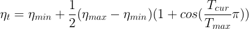
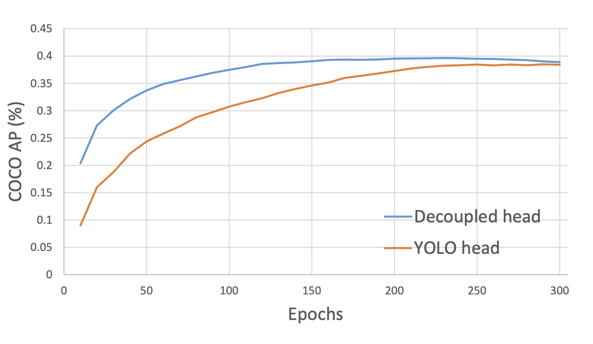
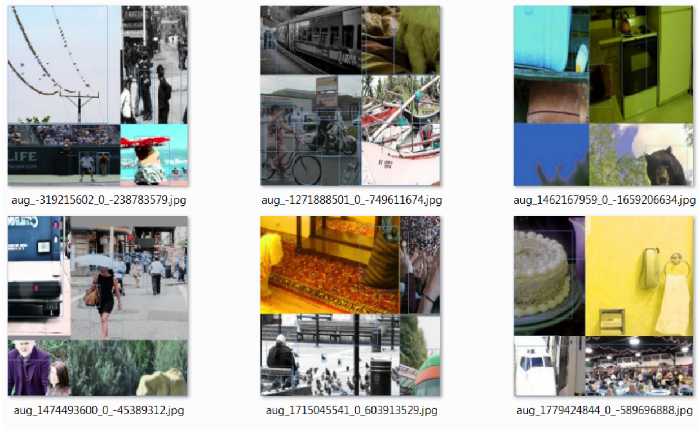
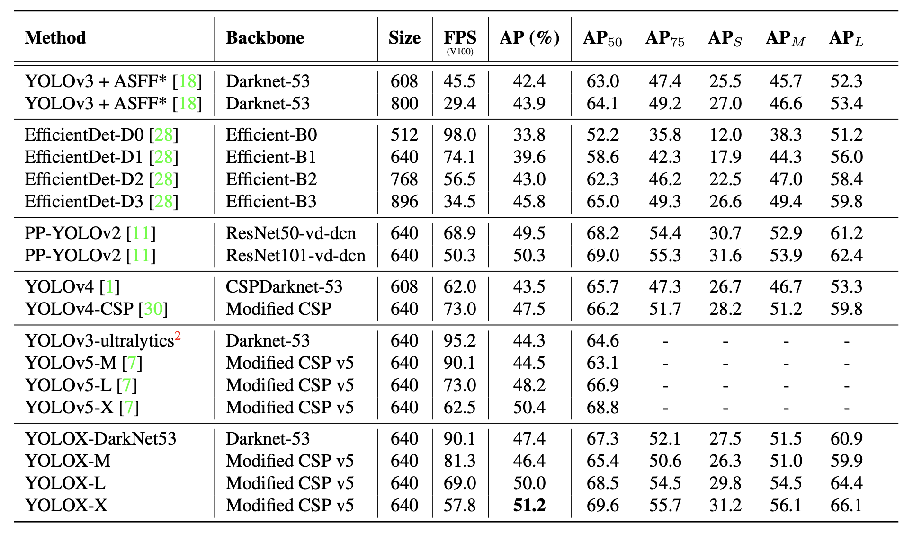

# Duck-Detection with YOLOX

## Introduction

[YOLOX](https://github.com/Megvii-BaseDetection/YOLOX)는 YOLO의 anchor-free version입니다. 구조는 더욱 간단해졌지만, 더 나은 performance를 보입니다. 

> ## How to Train and Demo

- `/tools` 폴더의 py 파일을 실행해 train, eval, demo, export 기능을 사용할 수 있다.
- 인수인계 시 학습에 사용한 실행문을 `train.sh`로 저장하였다.
- 학습된 모델의 inference result는 `demo.sh`로 확인할 수 있다.
- pretrained weights(pth file)는 github repo에서 다운로드 가능. 나는 weights/yolox_s.pth 경로에 저장하였다. weights 폴더는 이를 위해 별도로 생성한 폴더다.
- `/tools/train.py`
    - `-n` 사전 정의된 모델의 이름을 통해 모델을 불러온다.
    - `-b` batch size
    - `-d` 학습에 사용하는 device의 수
    - `-f` EXP_FILE을 의미. 학습 시 experiment description file이다. -n argument를 사용하지 않고 별도로 experiment를 관리할 수 있다.
    - `--num_machines` training을 위한 node의 수
    - `--machine_rank` multi-node training을 위한 node rank
    - `--resume` checkpoint로부터 이어서 학습
    - `-c` ckeckpoint file
    - `-s` resume training시 start epoch
    - `--fp16` mix precision training. model 학습을 위한 resource와 inference time을 줄이기 위한 최적화 방법. [https://bo-10000.tistory.com/32](https://bo-10000.tistory.com/32) 참고
    - `--cache` RAM에 imgs를 저장해 빠르게 학습.
    - -o 1순위로 GPU 메모리를 독점
    - `-l` metrics을 위한 Logger
    - **exp 파일**은 `/exps` 폴더에 존재한다. exp 파일 수정을 통해 model에 대해 전반적인 커스텀이 가능하다. exp 파일은 `/yolox/exp/yolox_base.py`의 Exp class를 상속받고 있기 때문에 추가 수정이 필요한 경우 해당 class를 살펴보라. 인수인계자는 별도로 `my_yolox_base.py` 파일을 만들어 사용하였다.
- YOLOX 라이브러리는 코드가 잘 정리되어 있어서 사용하는데 크게 어려움이 없었다. 코드 실행 시에도 많은 요소들을 터미널에 출력한다. YOLOX의 터미널 출력을 살펴보면 어떠한 기능이 있는지, 어떤 부분이 커스텀 가능한지 짐작가는 부분이 많을 것이다.

## About YOLOX

**_아래의 설명은 [YOLOX paper](https://arxiv.org/abs/2107.08430)를 읽고 정리한 것입니다._**

다음은 최근 one-stage object detection 분야에서 성능 향상을 위해 제안된 알고리즘입니다.

1. anchor-free detection
2. advanced label assignment strategies
3. end-to-end (NMS-free) detectors

이러한 알고리즘들을 YOLO 모델에 적용시키는 것이 YOLOX의 목표입니다. YOLOv4, v5는 이미 anchor-based pipeline에 최적화 되었기 때문에 YOLOv3을 기준으로 개선 사항을 적용할 것입니다.

### YOLOv3 baseline

YOLOX는 YOLOv3-SPP에서 언급된 DarkNet53 backbone과 SPP layer를 채용했습니다.

여기에 다음 사항을 추가했습니다.

- EMA weights updating
    
    Model의 trainable weights의 이동평균을 weights로 update하는 방식입니다. 일정 기간의 이전 weights를 shadow로써 저장해두고 이동평균을 구합니다. 

- cosine lr schedule

    Learning rate가 cosine 함수의 주기에 따라 증가, 감소를 반복합니다. 
    
    

    이는 *SGDR: Stochastic Gradient Descent with Warm Restarts*에서 처음 제안되었습니다.

- [IoU loss and IoU-aware branch](my_docs/IoU-aware.md)

    IoU-branch를 통해 predicted box의 IoU를 추론해 predicted box의 confidence score와 localization accuracy의 상관관계를 강화합니다.

- BCE loss for class branch and object branch

- Simple data augmentation

    RandomHorizontalFlip, ColorJitter, multi-scale augmentation을 사용하였습니다.

    RandomResizedCrop은 사용하지 않았습니다. RandomResizedCrop이 향후 소개할 mosaic augmentation과 중복되기 때문입니다.

### Decoupled head

YOLO 시리즈는 coupled head를 유지한 채 발전해왔지만, classification branch와 localization branch가 분리된 decoupled head는 이제 one-stage 또는 two-stage object detedtion에서 널리 사용되고 있습니다. 이유는 다음과 같습니다.

1. YOLO의 head를 decoupled head로 대체하면, 수렴 속도를 매우 크게 향상시킬 수 있습니다.

    
    Figure 3: YOLOv3 head와 decoupled head가 적용된 detector의 학습 곡선입니다. COCO val에서 매 10 epochs마다 AP를 측정하였습니다. 이는 decoupled head가 기존 YOLOv3 head보다 더욱 빠르게 수렴하고 더 나은 성능에 도달함을 보여줍니다.

2. decoupled head는 end-to-end 버전의 YOLO를 위해 꼭 필요하다.

    |Models         |Coupled Head|Decoupled Head|
    |---------------|:----------:|:------------:|
    |Vanilla YOLO   |38.5        |39.6          |
    |End-to-end YOLO|34.3(-4.2)  |38.8(-0.8)    |

    Table 1: end-to-end YOLO에 대한 decoupled head의 효과. COCO dataset에서의 AP (%)로 측정.

### Strong data augmentation

- #### Mosaic

    YOLOv4에서 새로운 방법의 data augmentation로 소개되었으며, 다른 detector에서도 널리 사용되고 있다. (이미지 출처: [YOLOv4 paper](https://arxiv.org/abs/2004.10934))
    
    

    Mosaic는 4개의 training image를 섞는 기법이다. 반면에 CutMix는 2개의 이미지를 합친다. 이를 통해 일반적인 image의 context가 아닌, 다양한 크기(대체로 4개의 image를 하나로 합치면, object의 크기는 상대적으로 줄어들어 작은 object에 대한 학습이 가능하다.)와 다양한 위치(원본 이미지가 중앙에 있더라도 4개의 image를 합치면 더욱 다양한 위치에 object가 위치한다.)에서의 학습이 가능하다. 게다가 하나의 이미지를 학습할 때 4개의 이미지를 학습한 것과 유사하기 때문에 mini-batch size를 줄인 것과 같은 효과를 얻을 수 있다.

- #### MixUp

    classification 분야에서 사용되는 data augmentation 방식이다. 두 image를 linear interpolation을 통해 하나의 blended image로 만들며, one-hot encoded label에도 똑같은 연산을 수행한다. 

    개선 가능 사항 : CutMix[[paper](https://openaccess.thecvf.com/content_ICCV_2019/html/Yun_CutMix_Regularization_Strategy_to_Train_Strong_Classifiers_With_Localizable_Features_ICCV_2019_paper.html)]에서 MixUp의 한계를 주장하기도 했다. MixUp 대신 CutMix를 사용해보는 것도 고려해볼 수 있다.
    
### **Anchor-free**

#### anchor mechanism의 문제점

1. 최적의 performance를 달성하려면, clustering analysis를 통해 학습 전에 최적의 anchors의 집하블 결정해야한다. 이는 domain-specific하며 task에 대해 덜 일반화되어있다.

2. anchor mechamism은 detection heads의 복잡도를 증가시킨다.

    anchor-free detectors는 anchor-based detectors만큼의 성능 발전을 보여왔고, heuristic tuning과 그 외 많은 trick들이 필요없다. 이는 design parameter를 더욱 간단하게 만든다.

#### YOLO를 anchor-free 방식으로 변경하는 방법

- 각각의 location에서의 predictions를 3에서 1로 줄이고, prediction이 predicted box의 grid의 left-top corner, height와 width를 직접 추론한다.

- 각 object의 중심 위치를 positive sample로 정하고 scale range를 사전에 정의한다. 이는 각 object의 FPN level를 지명하기 위함이다.

    이러한 변경사항들이 parameter의 수를 줄이고 detector의 GFLOPS를 줄여 빠르게 만든다. 그러면서 성능은 유지한다.

### Multi positives

YOLOv3의 assigning rule를 일관되게 하기 위해, anchor-free version YOLO는 오로지 하나의 positive sample(center location)을 가진다. 그러면서 각 object의 다른 high quality predictions를 무시한다. 그러나 이는 학습 중에 일어나는 극도의 positive/negative 불균형 문제를 완화시켜 이익이 되는 gradients를 가져온다. FCOS[[paper](https://openaccess.thecvf.com/content_ICCV_2019/html/Tian_FCOS_Fully_Convolutional_One-Stage_Object_Detection_ICCV_2019_paper.html)]에서는 center 3×3 영역을 positives로 정하고 "center sampling"이라고 명명했다. 

### SimOTA

label assignment에서 중요한 네 가지 요점이 있다.

1. loss/quality aware
2. center prior
3. dynamic number of positive anchors for each ground-truth
4. global view

위 사항들을 반영시켜, 본 논문은 OTA를 발전시킨 SimOTA를 소개했다.

## Comparison

Table 6: COCO 2017 test-dev에서의 다양한 object detectors의 accuracy와 speed 비교. 공정한 비교를 위해 모든 model들은 300 epochs 학습하였다.

## Conclusion

본 논문에서는 YOLOv3에 decoupled head, anchor-free, advanced label assigning strategy등 최근의 발전된 detection techniques를 적용한 YOLOX를 소개했다. 이는 다른 YOLO models와 비교하여 speed와 accuracy에서 더 나은 trade-off 관계를 보여줬다. 그리고 별도의 hyperparameter tuning 없이도 일반화된 성능을 보여준다. YOLOX를 통해 실제 환경에서 기존보다 더 나은 성능의 one-stage object detection을 경험하기 바란다.

## Reference

- Ge, Z., Liu, S., Wang, F., Li, Z., & Sun, J. (2021). Yolox: Exceeding yolo series in 2021. arXiv preprint arXiv:2107.08430.